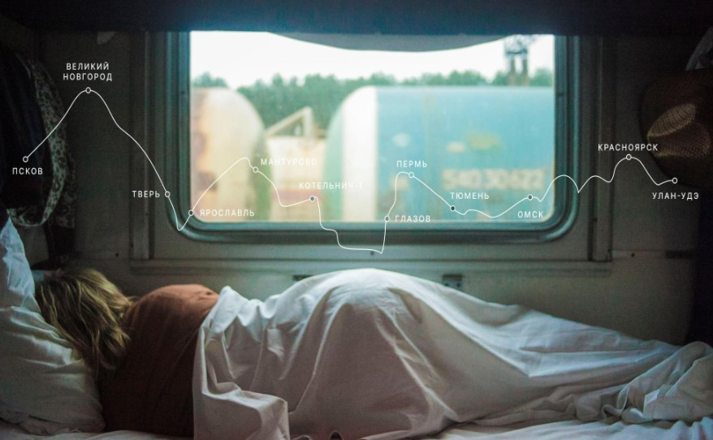
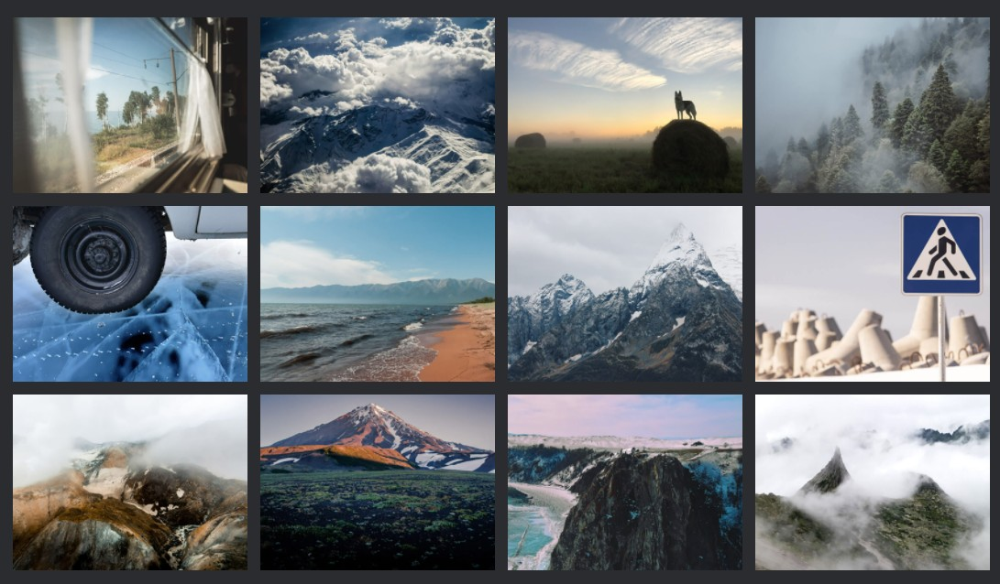
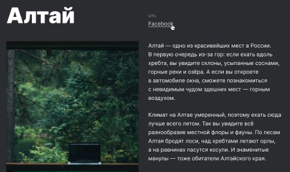
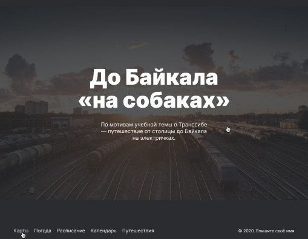
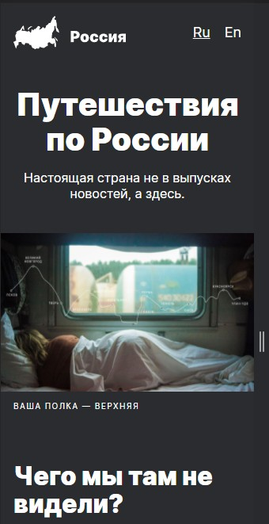

<h1 align="center">Путешествие по России</h1>

<a target="_blank">https://pasha-livinskiy.github.io/russian-travel/</a>

<h2 align="center">Описание</h2>

<h3> Сайт был сверстан с макета, с помощью программы Figma. Впервые использовал grid блоки</h3> 
<h3>На сайте имеются рабочии ссылки с затемнением</h3>

<h3>Также сайт адаптирован под разные устройства "но это не точно".

<h3 align="center"><a href="http://127.0.0.1:5500" target="\_blank">Демонстрация сайта</a></h3>
